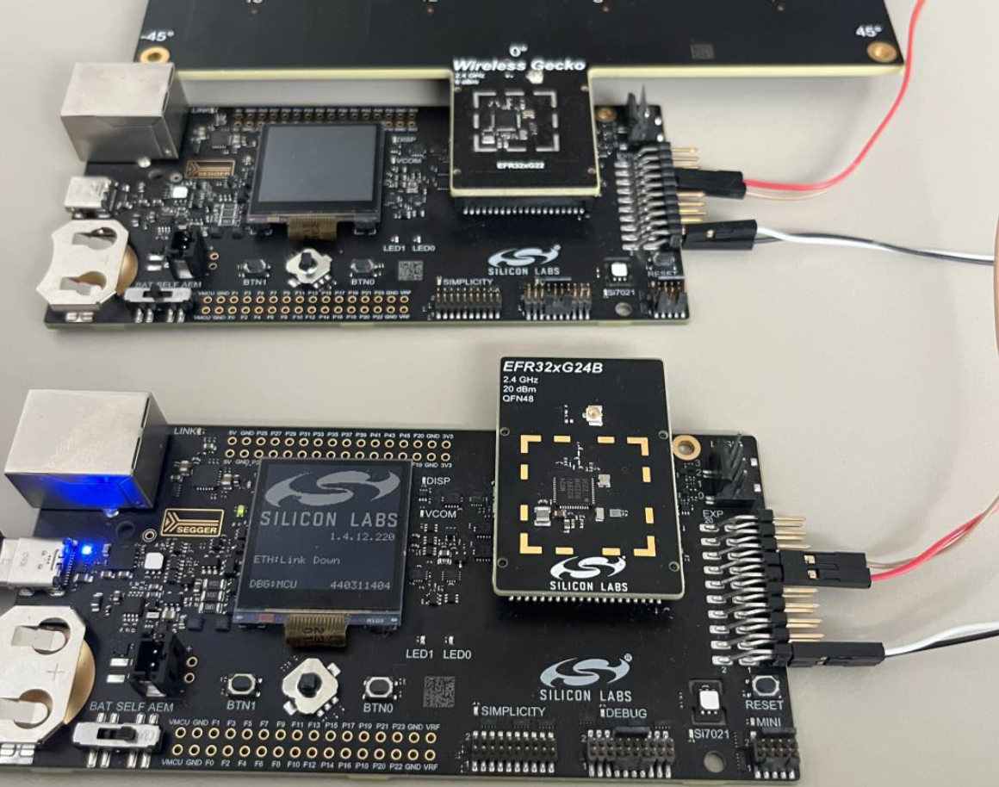
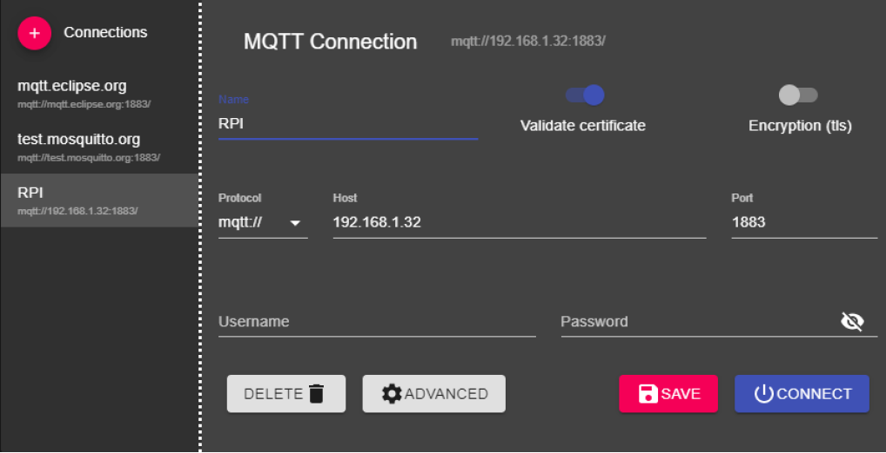
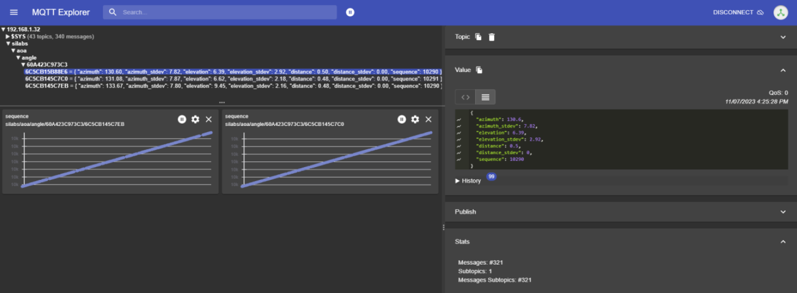

# Angle of Arrival locator project
- [Angle of Arrival locator project](#angle-of-arrival-locator-project)
  - [Overview](#overview)
    - [NCP firmware](#ncp-firmware)
    - [Host firmware](#host-firmware)
  - [Hardware requirements](#hardware-requirements)
  - [Software dependencies](#software-dependencies)
    - [Build with CMAKE](#build-with-cmake)
    - [Build with Makefile](#build-with-makefile)
    - [Build with Docker](#build-with-docker)
      - [Requirements](#requirements)
      - [How to build the docker image](#how-to-build-the-docker-image)
  - [How to use the project](#how-to-use-the-project)
    - [Network setup](#network-setup)
    - [MQTT usage](#mqtt-usage)

## Overview
The system contains 2 MCUs an EFR32xG24 (aka host) and an EFR32BG22 antenna array (aka NCP).
The NCP will receive the CTE packets (raw I/Q data) and transfers it to the host via UART.
The host receives it, processes it and logs it to the standard output.
Data is provided in JSON format and depending on the actual configuration it will be raw I/Q sample or angle information.
The angle information is calculated by the host with MVP (Matrix Vector Processor) from the I/Q samples.

If you are interested in other Bluetooth examples you can find more here:
[Bluetooth application examples](https://github.com/SiliconLabs/bluetooth_applications)

### NCP firmware
This is a simple locator NCP project, only change is that the VCOM is disabled (so the UART line can be used directly).

### Host firmware
Software components:
 - bt
 Bluetooth host sub-system, responsible for CTE data processing.
 Bluetooth specific settings are available in the `**/config folder`.
 All of the files here are part of the Silabs' GSDK except `sl_bt_aoa.c` and `sl_bt_aoa.h`.
 If GSDK update is necessary please update the components (sub-folders) manually from the newer GSDK.
 - drivers
 Custom project specific drivers.

## Hardware requirements
- 2pcs WSTK board (BRD4001 or BRD4002)
- 1pc NCP: BG22 antenna array (BRD4185A)
- 1pc HOST: MG24 host (BRD4187C)
- Tag(s) using the Silicon Laboratories proprietary CTE.
  In the test network BRD4187C was used with the SoC asset tag example ("bt_aoa_soc_asset_tag”).




## Software dependencies
Build system dependencies for ubuntu 22.04 lts systems:
 - CMake 3.25.4: https://github.com/Kitware/CMake/releases/tag/v3.25.3
 - Ninja
 - arm gcc compiler: arm-gnu-toolchain-12.2.rel1-x86_64-arm-none-eabi
 - Make - optionally if makefiles are used for build
 - Simplicity commander: https://www.silabs.com/documents/login/software/SimplicityCommander-Linux.zip

### Build with CMAKE
Usage (most modern IDE will natively support this):
1. Go to the project directory and configure:
    ```bash
    cmake <project_name>_cmake -B build -G "Ninja" -DCMAKE_BUILD_TYPE:STRING=<build_type>
    ```
    `<project_name>` can be either `locator_host` or `locator_ncp`.
    `<build_type>` can be `Debug` or `Release`.
    This must be done with a fresh project or when the build recipe changes
2. Build
    ```bash
    cmake --build build --parallel 8 --config <build_type>
    ```
    `<build_type>` can be `Debug` or `Release`, but must be same as in the previous step.
    This must be invoked when you change a source/header file.

### Build with Makefile
This is a wrapper for the CMAKE build.
To build every binary you shall run (in the root folder)
```bash
make
```
The following targets are available:
 - `all` (everything below, this is the default)
 - `locator_host`
 - `locator_ncp`
The following arguments can be also added:
 - `TARGET`: What shall be the target inside the target. Following options available:
   - `clean_build`: Will call `clean`, `configure` and `build`. This is the default.
   - `clean`: Cleans the build directory.
   - `configure`: Configures CMAKE for the build
   - `build`: Builds either `locator_host` or `locator_ncp`
 - `TYPE`: What shall be the build configuration either `Debug` or `Release`.

Example (secure release build without flashing):
```bash
make locator_host TARGET=build TYPE=Release
```

You can also use the Makefiles in the project directory, only difference that the `TARGET` variable becomes the Makefile target.
Example:
```bash
make build
```

### Build with Docker

#### Requirements
Build process was tested on Ubuntu 22.04 LTS.
 - Install docker: https://docs.docker.com/engine/install/ubuntu/
 - Post installation steps: https://docs.docker.com/engine/install/linux-postinstall/
  This is important because the script expects the current user have full docker managing access.

#### How to build the docker image
The *build-with-docker.sh* script handles all the building process.
You should start the script directly from the repo main folder. Otherwise the paths can be messed up.

You can use the following command line options:
  -  "-i" image_name    Specify the image name. Default value: *bluetooth-aoa-example-build-env*
  -  "-v" version       Specify the version of docker image. Default value: *1.0.0*
  -  "-r" registry      Specify the Docker registry to push the image to. Default value: *none*
  -  "-a" architecture  Specify architecture of build machine. Accepted values are `x86_64` and `aarch64`.  Defaults to `x86_64`
  -  "-c" clean         Boolean option. if it is added then after the build process the docker image is removed to save storage space. Default value: *true*

Example:
```bash
~/devs_xg24_aoa_poc$ sh .github/build-with-docker.sh -i bluetooth-aoa-example-build-env -v 1.0.0 -c
```

## How to use the project

The demo expects Tag(s) which are using the Silabs proprietary CTE. (The example project name is “bt_aoa_soc_asset_tag”.)
The firmware has verbose logging and it will log the MQTT messages to the standard output.
To view the debug prints one must use the [RTT viewer](https://www.segger.com/products/debug-probes/j-link/tools/rtt-viewer/).

After “OK” the following text shall be present:
“ Application reset! Reason: 0x3 BT NCP boot! Stack version: 7.0.1 (build 206)
MAC address (reversed endianness): 60A423C973C3 “

This means that the Bluetooth host and NCP is initialized.

### Network setup
If the MQTT capability of the demo system is required then the following are needed:
• A local network with full access.
• A MQTT broker. Mosquito is recommended. It’s easy to set up on a Raspberry PI, steps:
      1.Install OS
      2. Connect to the internet.
      3. sudo apt update && sudo apt upgrade
      4. sudo apt install -y mosquitto mosquitto-clients
      5. sudo systemctl enable mosquitto.service
      6. sudo nano /etc/mosquitto/mosquitto.conf
      7. Add to the config file: “listener 1883”
      8. Add to the config file: “allow_anonymous true”
      9. Save and close config file
      10. reboot raspberry
      11. Check installation success with: “mosquitto -v”
• A MQTT client (to check the published messages). MQTT Explorer is recommended.
Encryption shall be disabled, password and username shall be left blank, IP must be the raspberry’s IP.



### MQTT usage

There is a python script under “locator_host/tools/mqtt_forwarder” folder called “main.py”.
This can be used to forward the debug output of the host (MG24) to the MQTT broker.
Usage description can be found at the python script’s folder in the README file.

Example:
```
“ locator_host\tools\mqtt_forwarder>py main.py --mqttBrokerAddress 192.168.1.32 --serialNo 440311404 ”
```
Expected Output:
```
“ Connecting to MQTT broker at 192.168.1.32 MQTT Publish!
Topic: silabs/aoa/angle/60A423C973C3/6C5CB145C7BC
Message: {"azimuth": -49.86,"azimuth_stdev": 4.61,"elevation": 17.50,"elevation_stdev": 5.30,
"distance": 0.04,"distance_stdev": 0.00,"sequence": 1} “
```

If you’re using MQTT explorer then you should see a similar screen as below.


## Disclaimer
The Gecko SDK suite supports development with Silicon Labs IoT SoC and module devices. Unless otherwise specified in the specific directory, all examples are considered to be EXPERIMENTAL QUALITY which implies that the code provided in the repos has not been formally tested and is provided as-is. It is not suitable for production environments. In addition, this code will not be maintained and there may be no bug maintenance planned for these resources. Silicon Labs may update projects from time to time.
